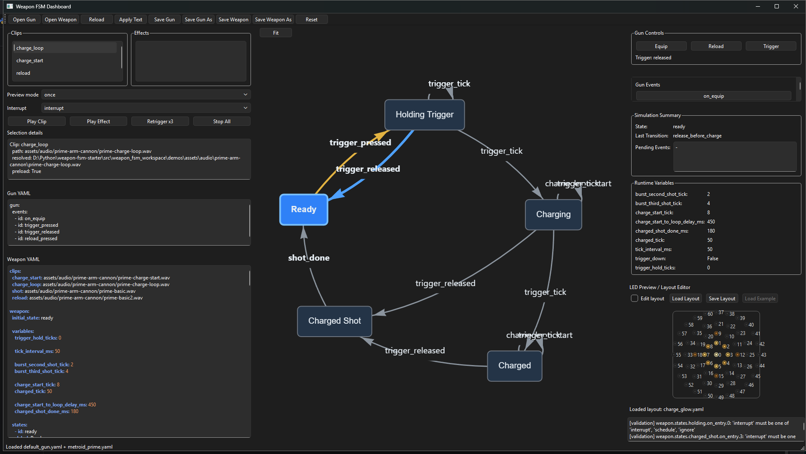
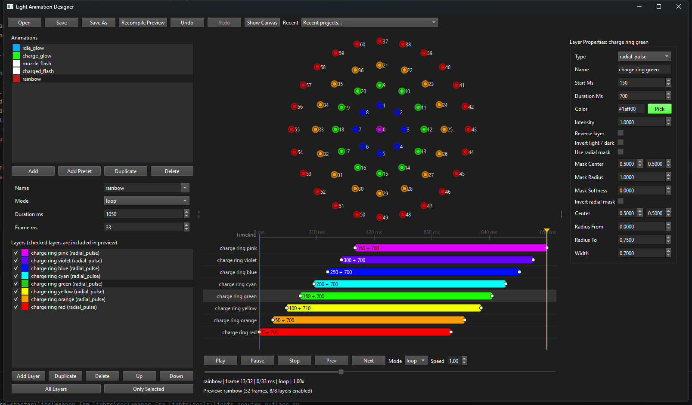
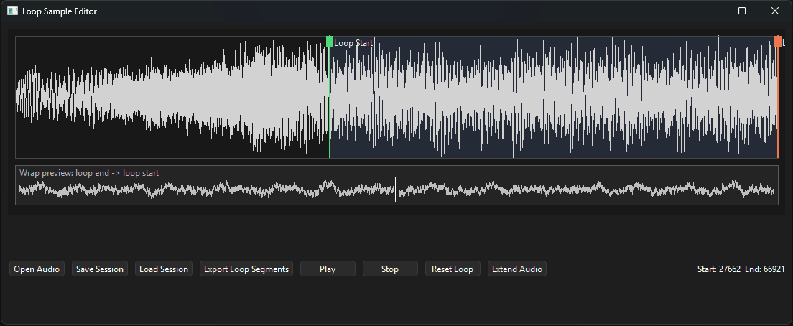

# Weapon FSM Editor

Weapon FSM Editor is a desktop editor, simulator, and validation tool for building configurable weapon prop behavior profiles. It is designed for projects where weapon behavior, audio, lights, input handling, and runtime commands need to be authored from data files instead of hardcoded into firmware or desktop runtime code.

The editor uses a YAML-based weapon profile format and a modular subsystem architecture so features like audio, lights, haptics, displays, or future runtime systems can be added without rewriting the core state machine.



## What It Does

Weapon FSM Editor lets you design and test weapon behavior profiles before deploying them to a runtime target.

You can use it to:

- Edit weapon behavior in YAML.
- Define finite state machine states and transitions.
- Configure firing, reloading, ammo, charge shots, burst fire, and full-auto behavior.
- Trigger runtime commands when states are entered or transitions occur.
- Validate profiles with useful error messages.
- Highlight invalid YAML sections directly in the editor.
- Simulate weapon behavior locally.
- Play desktop audio through an audio backend.
- Author and preview LED/light sequences.
- Organize audio clips, light layouts, and profile assets together.
- Keep subsystem-specific logic outside of the core weapon engine.

## Screenshots

### Main Window

The main window is the central workspace for opening a project, navigating editor pages, and working with weapon profile tools.


### Light Editor

The light editor is used to work with LED layouts and visual light effects such as muzzle flashes, charge glows, reload sweeps, and charged-shot bursts.



### Loop Editor

The loop editor is used to slice audio into loop-ready samples. Loop regions are defined with draggable markers, and the wrap preview helps verify that the transition from the end of the loop back to the beginning is seamless.

Once the loop is tuned, the selected segments can be exported as start, loop, and end samples as needed.



## What You Can Build

Weapon FSM Editor is built for creating interactive prop weapon profiles that combine behavior, timing, sound, and lights.

With the project, you can build profiles that support:

- Single-shot blaster behavior.
- Burst-fire patterns.
- Full-auto firing loops.
- Charge-up weapons.
- Charged-shot release behavior.
- Reload or reset actions.
- Timed events such as delayed loops, shot completion, and recurring ticks.
- Audio playback for shots, charge starts, charge loops, and impact-style effects.
- Light effects for muzzle flashes, charge glows, reload sweeps, and charged-shot bursts.
- Variable-driven behavior such as trigger hold duration, burst timing, and charge thresholds.

## Weapon Profiles

Weapon behavior is configured through YAML. A profile defines the resources the weapon can use, the runtime values it tracks, and the state machine that controls how the weapon responds to input and events.

### Main Profile Concepts

A weapon profile is built from three main parts:

1. **Assets**

   Assets give names to external files used by the weapon. These can include audio clips, light animations, LED layouts, or other resources. The behavior section can then reference assets by name instead of hardcoding file paths in every action.

   For example, a profile can define audio clips for a normal shot, charge start, charge loop, and charged shot. It can also define light animations for muzzle flashes, charge glows, reload effects, or other visual feedback.

2. **Runtime variables**

   Runtime variables are values the profile uses while the weapon is running. They are useful for counters, timing thresholds, delays, and tunable behavior.

   For example, a profile can track how long the trigger has been held, how often a tick event should repeat, when a burst shot should fire, or when a held trigger should become a charged shot.

3. **States and transitions**

   States describe what mode the weapon is currently in. Transitions describe how the weapon moves between those states in response to user input, scheduled events, or current runtime values.

   A state can run actions when entered, such as playing audio, starting a light animation, setting a variable, stopping audio, or scheduling an event. A transition can also run actions and may use guards to decide whether it should be allowed.

The result is a data-driven behavior file. Features like burst fire, charge shots, reloads, full-auto fire, charge loops, and light effects are created by combining assets, variables, states, transitions, events, guards, and actions.

### Metroid Prime Example

The included Metroid Prime arm cannon example demonstrates how a profile can combine weapon state behavior, audio playback, and light effects into one data-driven configuration.

At a high level, the file describes:

- An idle state waiting for player input.
- A basic fire path for normal shots.
- A charge path that starts a looping or sustained charge effect.
- A charged-fire path that plays a stronger shot effect.
- A reload or reset behavior where applicable.
- Audio clips for firing, charging, charged fire, and reload-style feedback.
- Light sequences for muzzle flashes, charge glow, and larger charged-shot flashes.

A shortened excerpt looks like this:

```yaml
name: Prime Arm Cannon
version: 1

states:
  idle:
    transitions:
      trigger_pressed: firing
      charge_started: charging

  firing:
    on_enter:
      - type: audio.play
        clip: basic_fire
      - type: lights.play
        sequence: muzzle_flash
    automatic_transition:
      target: idle
      after_ms: 80

  charging:
    on_enter:
      - type: audio.play
        clip: charge_start
      - type: lights.play
        sequence: charge_glow
    transitions:
      trigger_released: charged_fire

  charged_fire:
    on_enter:
      - type: audio.play
        clip: charged_fire
      - type: lights.play
        sequence: big_flash
    automatic_transition:
      target: idle
      after_ms: 120
```

The full demo profile can include additional audio clips, light sequence definitions, asset paths, and behavior rules. The README only shows a small section so the overall structure is easy to understand.

## Validation

The editor is designed to validate profiles in layers:

1. YAML syntax parsing.
2. Typed object construction.
3. Local model validation.
4. Runtime command validation.
5. Cross-reference validation.
6. Subsystem validation.
7. Editor document range mapping.

Validation can catch issues such as:

- Missing required sections.
- Unknown state references.
- Invalid transitions.
- Invalid runtime commands.
- Missing audio clips.
- Missing asset files.
- Invalid light sequence references.
- Invalid layout references.
- Subsystem-specific configuration errors.

Validation issues include structured paths like:

```text
audio.clips.reload.path: Clip 'reload' points to a missing file: assets/audio/prime-arm-cannon/reload.wav
```

The editor can use those paths to highlight the relevant YAML section.

## Audio System

The audio subsystem provides desktop playback for testing profiles.

Current design features include:

- Audio clip definitions in YAML.
- Audio clip banks.
- Runtime audio commands.
- PortAudio-backed playback.
- Multiple PortAudio implementation options for testing.
- Mixer stream support.
- Missing file validation.
- Playback policies to avoid unwanted overlapping sounds.
- Backend-level volume control.
- Feedback sounds for menu and volume interactions.

The core only needs to know how to route audio config and audio commands to the registered audio subsystem.

## Lights System

The lights subsystem provides LED layout and sequence support.

Current design features include:

- Top-level `lights` profile section.
- LED layout loading.
- Normalized 2D LED coordinates.
- Canvas-based sequence authoring.
- Reload effects.
- Charge glow effects.
- Muzzle flash effects.
- Layout overlays.
- Exportable layout data.
- Microcontroller-oriented sequence compilation.

The lights package can provide editor widgets while keeping light-specific loading and validation separate from the core package.

## Input and Menu System

The runtime input design supports both gameplay controls and menu navigation.

The menu system is intended to support:

- Holding up/down buttons to enter the menu.
- Up/down navigation.
- Reload/trigger as back/confirm controls.
- Timeout back to gameplay mode.
- Remembering the last selected menu item.
- Requiring confirmation before re-entering edit mode.
- File-driven menu configuration.
- A control API for settings such as volume.

## Simulation

The simulation service allows profiles to be tested from the desktop editor.

The simulator is intended to support:

- Loading profiles.
- Dispatching input events.
- Running state transitions.
- Running automatic transitions.
- Executing runtime commands.
- Testing ammo/reload behavior.
- Testing charge-shot behavior.
- Testing burst and full-auto behavior.
- Playing desktop audio.
- Previewing lights.

## Demos

Demo profiles are used to verify common behavior patterns and prevent regressions.

Useful demo cases include:

- Basic blaster.
- Reload behavior.
- Charge shot.
- Burst shot.
- Full-auto with ammo.
- Combined full-auto, ammo, charge-shot, and burst-shot behavior.
- Audio clip bank demos.
- Light sequence demos for reload, charge glow, and muzzle flash.

Demos should be round-trip tested by saving, loading back in, and verifying the resulting profile.

## Extending the Editor

Subsystems can register themselves with the core loader and validator.

A subsystem can provide:

- A top-level YAML section name.
- Typed configuration objects.
- Loading/deserialization support.
- Validation rules.
- Runtime command types.
- Runtime command handlers.
- Optional editor widgets.

This allows new systems such as haptics, displays, sensors, or microcontroller-specific outputs to be added using the same pattern as audio and lights.

## Development Setup

This project uses `uv` for package and environment management. Each library is maintained as its own Python package, so the editor can depend on the core package and optional subsystem packages without turning the repository into one large monolithic package.

Clone the repository:

```bash
git clone https://github.com/jfloyd1697/weapon-fsm-editor.git
cd weapon-fsm-editor
```

Create or sync the development environment:

```bash
uv sync
```

Run commands through the managed environment:

```bash
uv run python -m weapon_fsm_editor
```

If working inside an individual library package, run `uv` from that package directory or use the repository workspace configuration if one is provided.

## Running the Editor

```bash
uv run python -m weapon_fsm_editor
```

The editor package depends on the core weapon package and whichever subsystem packages are enabled for the current project.

## Running Tests

```bash
uv run pytest
```

Recommended test coverage includes:

- Profile loading.
- Profile saving.
- YAML round trips.
- State transitions.
- Automatic transitions.
- Runtime command validation.
- Audio config validation.
- Lights config validation.
- Analyzer path mapping.
- Editor document range mapping.
- Demo profile loading.

## Asset Path Notes

Profile assets should resolve relative to the project/profile root. Asset paths should not accidentally treat the YAML file itself as a directory.

For example, this should resolve from the profile project root:

```yaml
audio:
  clips:
    reload:
      path: assets/audio/prime-arm-cannon/reload.wav
```

Missing assets should produce validation messages that point to the specific profile path that failed.

## Roadmap

Near-term work:

- Finalize the compact profile object structure.
- Keep validation flexible without creating too many model classes.
- Improve live YAML highlighting accuracy.
- Complete audio backend comparison support.
- Complete lights package integration into the main window.
- Add stable demos for full-auto, ammo, charge-shot, and burst-shot behavior.
- Verify save/load round trips for every demo.
- Add file-driven menu configuration.
- Add complete volume control workflows.

Future ideas:

- Socket bridge to a C++ runtime simulator.
- Runtime state-change streaming back to the editor.
- Microcontroller export pipeline.
- Haptics subsystem.
- Display subsystem.
- Timeline-style visual editing for lights and audio.

## License

Add the project license here.

